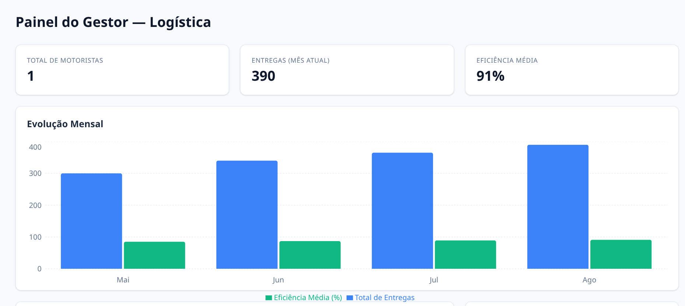

# Dashboard do Gestor — Logística Gamificada

## 📌 Contexto do Projeto
Este projeto é um protótipo de dashboard de gestão logística gamificada, focado no acompanhamento de desempenho de motoristas. Ele apresenta um ranking baseado em pontos (com níveis calculados dinamicamente), indicadores de eficiência e conquistas desbloqueadas.

O painel foi desenvolvido como inspirado no processo seletivo para a vaga de Desenvolvedor(a) Frontend do edital IMD/MAGISDEV.

## 🚀 Demonstração
- **Live Demo (Frontend):** [Substitua pelo link da Vercel/Netlify]
- **API Mockada:** https://dashboard-gestor.onrender.com

> ⚠️ A API roda no plano gratuito do Render, que "dorme" após um tempo sem uso. A primeira requisição depois de um período de inatividade pode levar de 30 a 50 segundos para responder.



## 🛠️ Tecnologias Utilizadas
- **React (JavaScript)**: Biblioteca principal para construção da interface estruturada em componentes.
- **Vite**: Ferramenta de build e servidor de desenvolvimento otimizado.
- **Tailwind CSS**: Estilização utilitária, responsiva e consistente em todo o painel.
- **Recharts**: Biblioteca declarativa para visualização de dados e gráficos.
- **json-server**: Simulação de API REST (banco de dados em `db.json`), hospedada no Render, consumida no frontend com fetch real.

## ⚙️ Como rodar localmente

### 1. Pré-requisitos
Certifique-se de ter o [Node.js](https://nodejs.org/) instalado na máquina.

### 2. Instalação
Clone o repositório e instale as dependências:
```bash
git clone https://github.com/seu-usuario/dashboard-gestor.git
cd dashboard-gestor
npm install
```

### 3. Execução
Por padrão, o frontend já consome a API publicada no Render (`src/api/api.js`), então basta rodar:

```bash
npm run dev
```
*(O frontend ficará disponível em http://localhost:5173)*

### 4. (Opcional) Rodando com a API local
Se preferir testar com dados locais em vez da API publicada:

1. Troque `BASE_URL` em `src/api/api.js` para `http://localhost:3001`.
2. Em um segundo terminal, suba a API mockada:
   ```bash
   npm run mock-api
   ```
   *(A API ficará disponível em http://localhost:3001)*

## 🎮 Gamificação
O nível de cada motorista é calculado dinamicamente a partir dos pontos (`utils/gamification.js`), com faixas de 1 a 5, e exibido no ranking junto com uma barra de progresso até o próximo nível.
